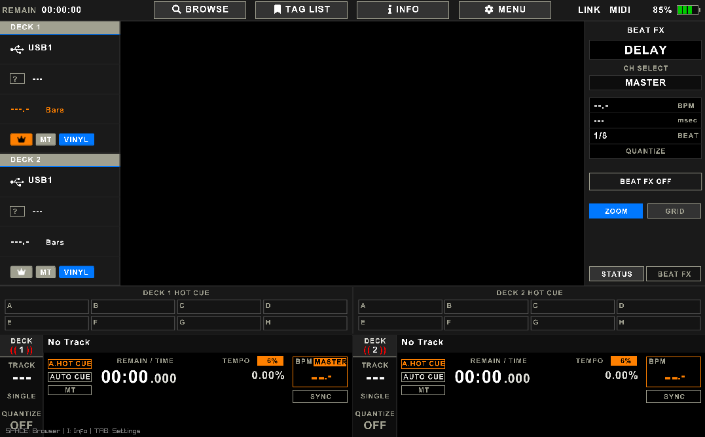

# UNX DJ ENGINE

UNX DJ ENGINE is an experimental DJ Media Player firmware subset, ported to C and Raylib for high-performance cross-platform development, simulation, and embedded deployment. It aims to provide a professional-grade mixing experience inspired by industry-standard hardware.



## Features

### Audio Engine
- High-fidelity 32-bit float internal mixing pipeline.
- Multi-format decoding support: MP3 (minimp3), WAV, and AIFF (dr_wav).
- Advanced Master Tempo and Pitch-shifting using professional SoundTouch and Mixxx-based processing engine.
- Sophisticated Read-Ahead Manager with cross-fading seek logic for artifact-free performance.
- Professional 3-Band ISO EQs and Filters (Biquad).
- Integrated Sound Color FX and BPM-synced Beat FX.
- Reliable mono-to-stereo automatic upmixing and lock-free parameter synchronization.

### User Interface
- Ultra-responsive UI rendered with Raylib and OpenGL.
- Multi-style Waveform displays (Blue, RGB, 3-Band Spectrum).
- Dynamic layout scaling for multiple resolutions and high-DPI displays.
- Hardware-accurate Top Bar, Deck Strips, and FX Panels.

### Library and Browser
- Deep integration with Rekordbox (PDB/ANLZ) databases.
- Serato metadata and waveform parsing support.
- Advanced Browser with Playlist Bank (Drag-and-Drop shortcuts).
- Multi-device storage scanning (USB/SD/Internal).

### Platform Support
- Windows (x64): Native development and simulation.
- Linux (ARM64): Optimized for embedded targets using DRM-KMS and GLES2.
- Android (ARM64): Experimental builds for mobile devices.

- More Sound Color FX and Beat FX.
- Integrated Audio Recording (WAV/FLAC).
- Pro DJ Link / Networking for multi-player synchronization.

## Project Status / Plans

- [x] **Professional Audio Engine**: High-fidelity SoundTouch & Mixxx DSP integration.
- [x] **Mixer & DSP**: 3-band ISO EQs, Filters, and FX pipeline functional.
- [x] **Rekordbox Integration**: Full PDB/ANLZ metadata and waveform support.
- [x] **Cross-platform UI**: High-performance Raylib rendering on Win/Linux/Android.
- [/] **MIDI/HID Support**: Logic implemented, full integration in progress.
- [/] **Serato Support**: Metadata parsing and database integration functional, waveforms in progress.

## Build Instructions

The project uses Zig as a C/C++ compiler for seamless cross-compilation, integrating C logic with C++ audio processing via a robust bridge.

### Windows
Run the provided build script:
```powershell
./build.bat
```

### Linux / Embedded
Use the included Makefile:
```bash
make PLATFORM=LINUX_ARM64
```

### Android
Automated builds are available via GitHub Actions. For manual builds, ensure Android NDK is installed and run:
```bash
make -f android/Makefile.android
```


## Credits

Developed as part of the UNX DJ ENGINE project ecosystem.

Special thanks to:
- [Mixxx](https://mixxx.org/) development team for architectural insights and DSP logic.
- [SoundTouch](https://www.surina.net/soundtouch/) library for high-quality time-stretching.
- [Raylib](https://www.raylib.com/), [minimp3](https://github.com/lieff/minimp3), and [dr_libs](https://github.com/mackron/dr_libs) contributors.

## Social Media and Links

Follow the project progress:
- GitHub: [github.com/unxchr](https://github.com/rayocta303)
- YouTube: [youtube.com/@unxchr](https://youtube.com/@unxchr)
- Instagram: [instagram.com/unxchr](https://instagram.com/unxchr)

## Donation

If you find this project useful and would like to support its development:
- PayPal: [paypal.me/unxchr](https://paypal.me/unxchr)
- Saweria: [saweria.co/patradev](https://saweria.co/patradev)

---
Disclaimer: This project is for educational and experimental purposes only.
