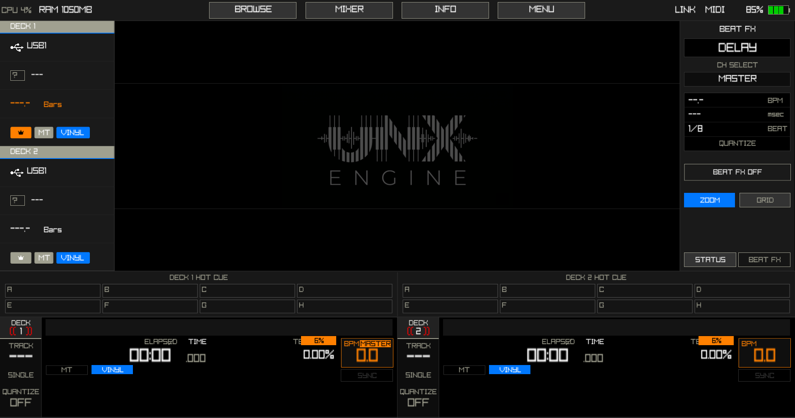

# UNX DJ Engine



UNX DJ Engine is a specialized, high-performance DJ media player firmware subset. Developed in C and C++, it leverages the Raylib framework to provide a robust environment for cross-platform simulation, embedded development, and professional-grade audio processing. The project is engineered to replicate industry-standard hardware workflows while maintaining low-latency execution and high-fidelity signal processing.

## Core Architecture

### Audio Processing Engine
- **Engine Core**: Fully ported Mixxx Audio Engine (subset) for industry-standard reliability.
- **Internal Pipeline**: 32-bit floating-point internal mixing and DSP for maximum dynamic range and headroom.
- **Memory Optimization**: High-efficiency 16-bit PCM audio buffering, reducing RAM footprint by 50% for long-duration tracks.
- **Decoding Engine**: Native support for MP3 (minimp3), WAV, and AIFF (dr_wav) formats.
- **Time-Stretching**: High-fidelity Master Tempo and pitch-shifting utilizing Rubber Band and SoundTouch algorithms.
- **Signal Processing**: Professional 3-Band Isolator EQs (Fidlib), Biquad Filters, and an integrated FX pipeline (Sound Color FX and BPM-synced Beat FX).
- **Synchronization**: Precise lock-free parameter synchronization and automatic mono-to-stereo upmixing.

### User Interface and Rendering
- **Graphics Engine**: Low-latency rendering via Raylib and OpenGL/GLES.
- **Visualization**: Optimized multi-mode waveform rendering with "Range-Vision" culling and Peak Binning (LOD) for flicker-free performance.
- **Responsive Design**: Adaptive layout engine supporting varying resolutions and High-DPI hardware configurations.
- **PAD View**: Integrated Performance Pads (4x2 grid) for instant Hot-Cue triggering and deck interaction.
- **Hardware Accuracy**: Precise emulation of industry-standard deck strips, top bars, and control panels.
### Database and Library Management
- **Rekordbox Integration**: Full parsing of PDB and ANLZ database structures for metadata and waveform data.
- **Serato Compatibility**: Support for Serato metadata and waveform parsing logic.
- **Storage Management**: Efficient scanning and indexing for USB, SD, and internal storage devices.

## Project Structure

```text
├── assets/             # UI Assets (Fonts, Icons, Splash)
├── controllers/        # MIDI/HID Controller mappings
├── lib/                # Third-party libraries (Raylib, RubberBand, SoundTouch, etc.)
├── screenshots/        # Application UI screenshots
├── src/
│   ├── core/           # Audio backend (miniaudio), Logger, Logic (Sync/Quantize)
│   ├── engine/         # Ported Mixxx Audio Engine (Mixers, Buffers, FX, Sync)
│   ├── library/        # Database Readers (Rekordbox PDB/ANLZ, Serato)
│   ├── ui/
│   │   ├── browser/    # Library navigation and search UI
│   │   ├── components/ # Reusable UI widgets and Theme system
│   │   ├── player/     # Deck UI, Waveform rendering, DeckStrip
│   │   └── views/      # Main application views (Info, Settings, Mixer, About)
│   ├── main.c          # Application entry point and main loop
│   └── version.h       # Build metadata and versioning
└── tools/              # Build utilities and asset generators
```

## Technical Specifications

| Component | Technology |
|-----------|------------|
| Language | C / C++ (C17 / C++17) |
| Graphics API | OpenGL 3.3 / GLES 2.0 / GLES 3.0 |
| Framework | Raylib |
| Compiler | Zig Toolchain |
| Audio I/O | miniaudio |
| Audio Engine | Ported Mixxx Core (v2.4+) |
| Time-Stretching | Rubber Band / SoundTouch |
| EQ/Filters | Fidlib |
| FFT/DSP | QM-DSP |

## Deployment Platforms

- **Windows (x86_64)**: Primary environment for development, simulation, and testing.
- **Linux (ARM64/x64)**: Support for multiple graphics backends:
    - **DRM-KMS**: Optimized for embedded/firmware targets without a window manager.
    - **Wayland**: Modern desktop Linux support (e.g., Phosh on postmarketOS).
    - **X11**: Legacy desktop Linux compatibility.
- **Android (ARM64)**: Mobile-optimized builds with NDK integration.
- **iOS (ARM64)**: Native UIKit/CAEAGLLayer integration for high-performance mobile execution.

## Tested Devices

| Device | Status | Note |
|--------|--------|------|
| Armbian S905X Board | ✅ Working | |
| Windows 10 (HP Probook X360) | ✅ Working | Primary Dev Environment |
| Xiaomi Redmi Note 3 Kenzo (Snapdragon) | ✅ Working | |
| Xiaomi Redmi Note 13 | ✅ Working | |
| Xiaomi Redmi Note 3 Hennessy (Mediatek) | ❌ Not Working | Stuck / Blank Screen |

> [!IMPORTANT]
> If you encounter bugs or issues on a specific device, please let us know the device model and the nature of the bug by opening an issue. Your feedback helps us improve compatibility across more hardware.


## Project Roadmap

- [x] **Core Mixer**: Implementation of 3-band ISO EQs, Filters, and basic FX pipeline.
- [x] **Metadata Engine**: Integration of Rekordbox PDB/ANLZ database parsing.
- [x] **Cross-platform UI**: Unified rendering across desktop, embedded, and mobile platforms.
- [x] **Master Tempo**: High-fidelity time-stretching via Rubber Band/SoundTouch.
- [x] **Performance Pads**: Native PAD view for hot-cue and deck control integration.
- [/] **MIDI/HID Control**: Low-latency hardware mapping integration in progress.
- [/] **Advanced FX**: Expansion of the Beat FX and Sound Color FX libraries.

## Build and Installation

The project utilizes the Zig toolchain for seamless cross-compilation and dependency management. Ensure the `ZIG` environment variable points to your `zig.exe`.

### Windows Environment
Execute the provided batch script to build for Windows:
```powershell
./build.bat windows
```

### Linux (Cross-Compilation from Windows)
Build for specific graphics backends using the batch script:
```powershell
# For Embedded Firmware (DRM-KMS)
./build.bat linux drm

# For Desktop/Wayland/X11
./build.bat linux desktop
```

### Linux (Native Build)
Utilize the included `build.sh` script:
```bash
# Default (DRM)
./build.sh drm

# Desktop (Wayland/X11)
./build.sh desktop
```

### Android and iOS
Mobile builds are managed via GitHub Actions CI/CD pipelines.

## Keyboard Shortcuts

> [!NOTE]
> Keyboard shortcuts are currently **hardcoded** and cannot be customized in the current version.

| Key | Action |
|-----|--------|
| **Z** | Play / Pause (Deck 1) |
| **A** | Cue (Deck 1) |
| **1 - 5** | Hot Cues A - E (Deck 1) |
| **Q** | Sync / Beat Sync (Deck 1) |
| **F** | Beat FX Toggle (Deck 1) |
| **N** | Play / Pause (Deck 2) |
| **H** | Cue (Deck 2) |
| **6 - 0** | Hot Cues A - E (Deck 2) |
| **Y** | Sync / Beat Sync (Deck 2) |
| **J** | Beat FX Toggle (Deck 2) |
| **SPACE** | Toggle Browser View |
| **I** | Toggle Track Info View |
| **TAB** | Toggle Settings View |
| **M** | Toggle Mixer View |
| **ESC** | Back / Exit View |

## Credits and Acknowledgments

UNX DJ Engine is developed within the UNX DJ project ecosystem. It leverages a significant portion of the Mixxx open-source engine, adapted for embedded and low-latency environments.
- **Mixxx Development Team**: Core audio engine architecture, DSP logic, and signal processing.
- **Rubber Band / SoundTouch**: High-quality time-stretching and pitch-shifting algorithms.
- **Raylib, minimp3, dr_libs**: Core framework and media decoding libraries.

## Contact and Social Media

- **GitHub**: [github.com/rayocta303](https://github.com/rayocta303)
- **YouTube**: [@unxchr](https://youtube.com/@unxchr)
- **Instagram**: [@unxchr](https://instagram.com/unxchr)

## Support and Development

For those interested in supporting the continued development of this project:
- **PayPal**: [paypal.me/unxchr](https://paypal.me/unxchr)
- **Saweria**: [saweria.co/patradev](https://saweria.co/patradev)
